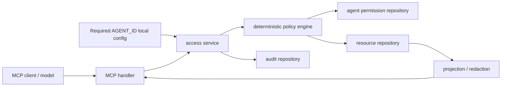

# AgentGuard MCP

AgentGuard MCP is a small Go-based MCP authorization gateway that demonstrates least-privilege access for AI agents requesting synthetic business resources.

This is an independent educational project built from public MCP and generic security patterns. It uses only synthetic data and does not represent any real company, customer, employee, product architecture, or confidential system.

## Problem Statement

AI agents can ask for data, but the model should not be trusted to decide what it is allowed to see. AgentGuard MCP separates model-controlled requests from deterministic server-side authorization. The model provides a resource, purpose, and requested scope; Go code loads the agent identity from trusted server configuration, resolves permissions server-side, applies default-deny policy, projects only approved fields, and audits the decision.

## Project Scope

AgentGuard MCP demonstrates:

- MCP tools over stdio.
- Trusted workload identity represented locally by `AGENT_ID`.
- Server-side permission resolution.
- Default-deny authorization.
- Purpose limitation.
- Scope validation.
- Minimum-data projection and redaction.
- Audit records for both allowed and denied requests.

It deliberately does not include cloud services, persistent storage, OAuth, external identity providers, an LLM API, a frontend, Docker, or production deployment.

## Architecture



Security flow:

```text
MCP handler
-> access service
-> resolve configured agent from server context
-> validate purpose and scope
-> fetch resource once for known-agent eligible requests
-> deterministic policy engine
-> projection/redaction
-> audit repository with random audit ID
```

Unknown configured agents are denied before resource lookup, so they cannot distinguish existing resource IDs from nonexistent ones.

## Package Structure

- `cmd/server`: executable MCP server, required `AGENT_ID` loading, synthetic seed data, stderr logging.
- `internal/access`: resource models, deterministic policy evaluation, projection/redaction, explanations.
- `internal/audit`: audit event model.
- `internal/storage`: concurrency-safe in-memory repositories.
- `internal/mcpserver`: typed MCP tool adapter layer.

## MCP Tools

### `request_resource_access`

Input:

```json
{
  "resource_id": "ticket-1001",
  "purpose": "customer_support",
  "requested_scopes": ["ticket.read"]
}
```

Behavior:

- Loads the agent identity from trusted server context.
- Resolves the identity to server-side permissions.
- Applies default-deny authorization.
- Validates purpose and scope.
- Returns only fields approved for the granted scope.
- Audits both allow and deny decisions.

The tool does not accept `agent_id`, role, or permissions from model-controlled input.

### `explain_access_decision`

Input:

```json
{
  "audit_event_id": "audit-123"
}
```

Behavior:

- Returns a safe explanation for the configured agent's decision.
- Does not reveal secrets or sensitive policy internals.
- Does not allow the model to select a different agent.

### `list_my_audit_events`

Input:

```json
{
  "limit": 10
}
```

Behavior:

- Returns audit events only for the configured local demo agent.
- Does not accept an agent selector from the model.
- `limit` of `0` uses a safe default of 20.
- Valid `limit` values are 1 through 100.
- Results are the most recent events only.

## Synthetic Resources

The demo seeds:

- `ticket-1001`: support ticket.
- `invoice-2001`: invoice.
- `employee-3001`: employee profile.

All values are synthetic placeholders.

## Required Policies

- `support-agent-001` may use `customer_support` + `ticket.read`.
- `finance-agent-001` may use `payment_operations` + `invoice.read`.
- `hr-agent-001` may use `workforce_administration` + `employee.read`.
- Support agents cannot read invoices.
- Finance agents cannot read employee profiles.
- Marketing purpose cannot access sensitive resources.
- Unknown agents are denied.
- Unsupported purposes and scopes are denied.
- Every allow and denial is audited.
- Responses expose only fields approved for the scope.

## Trusted Identity

For local demonstration, the configured agent identity is loaded from:

```sh
AGENT_ID=support-agent-001
```

`AGENT_ID` is required. If it is absent, the server fails fast with a clear stderr message.

This environment variable configuration is only a local demonstration and is not production authentication. In production, it would be replaced by authenticated workload identity, such as signed service identity, OAuth token introspection, SPIFFE/SPIRE, mTLS-bound identity, or a platform identity provider. The model should never provide its own role, permissions, or agent identifier.

## Security Decisions

- Authorization is deterministic Go code, not model reasoning.
- Model-controlled input is limited to resource ID, purpose, and requested scopes.
- Agent permissions are resolved server-side before any resource lookup.
- Policy is default-deny.
- Each known-agent request fetches the resource at most once and authorizes the same value later projected.
- Projection happens after authorization and returns only scope-approved fields.
- Audit logging records allowed and denied decisions with random IDs from Go's standard `crypto/rand` package.
- Access fails closed if an audit ID cannot be generated or an audit event cannot be written.
- Logs go to stderr because stdout is reserved for MCP protocol traffic.

## Threat Model

AgentGuard MCP focuses on these risks:

- Prompted model asks for resources outside its role.
- Model supplies a misleading purpose.
- Model requests unsupported or excessive scopes.
- Unknown workload identity attempts access.
- Allowed access accidentally returns more fields than the scope permits.
- Denied access attempts disappear without audit evidence.

Out of scope for this weekend MVP:

- Real production authentication for workload identity.
- Persistent audit storage and retention controls.
- Distributed policy administration.
- Secret management.
- Tamper-resistant logs and centralized monitoring.
- Network transport hardening.
- Multi-tenant isolation.

## Local Setup

Requires Go 1.27.

```sh
go mod tidy
AGENT_ID=support-agent-001 go run ./cmd/server
```

The server speaks MCP over stdio. Configure an MCP-compatible client to run `go run ./cmd/server` with the desired `AGENT_ID` environment variable. The process will exit if `AGENT_ID` is omitted.

## Tests

```sh
gofmt -w cmd internal
go test ./...
go test -race ./...
go vet ./...
```

## Demo Scenarios

Allowed support ticket access:

```sh
AGENT_ID=support-agent-001 go run ./cmd/server
```

Call `request_resource_access`:

```json
{
  "resource_id": "ticket-1001",
  "purpose": "customer_support",
  "requested_scopes": ["ticket.read"]
}
```

Denied support agent reading invoices:

```sh
AGENT_ID=support-agent-001 go run ./cmd/server
```

Call `request_resource_access`:

```json
{
  "resource_id": "invoice-2001",
  "purpose": "payment_operations",
  "requested_scopes": ["invoice.read"]
}
```

Allowed finance invoice access:

```sh
AGENT_ID=finance-agent-001 go run ./cmd/server
```

Call `request_resource_access`:

```json
{
  "resource_id": "invoice-2001",
  "purpose": "payment_operations",
  "requested_scopes": ["invoice.read"]
}
```

## Future Improvements

- Replace `AGENT_ID` with authenticated workload identity.
- Add OAuth or token introspection at the server boundary.
- Store audit events durably.
- Add tamper-evident audit chains.
- Support richer policy configuration.
- Add structured denial codes.
- Add integration tests with an MCP client.
